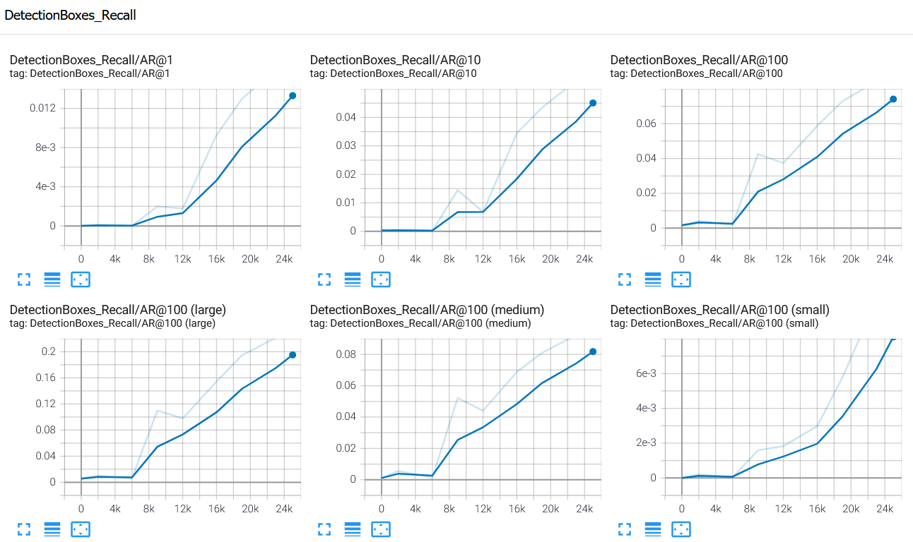
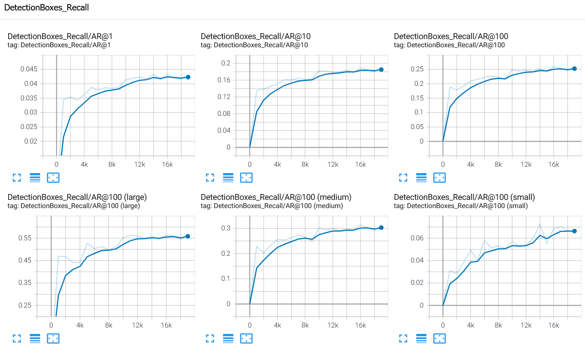

# Object Detection in Urban Environment

<p align="center">
  
</p>

## Installation:
1. Clone the Repository:
```
git clone https://github.com/AndresGarciaEscalante/Object_Detection_Urban_Environment
```
2. Install the requirements for the project with the following command line:
```
python setup.py
```
## Run Code:
### Download and process data 
Go to the *download_process.py* folder and execute the following command line:
```
python download_process.py --data_dir ../data/ --temp_dir ../backups/
```
### Exploratory Data Analysis
Go to the *Exploratory Data Analysis.ipynb* folder and execute the following command line:
```
jupyter notebook
```

### Create the splits
Go to the *create_splits.py* folder and execute the following command line:
```
python create_splits.py --data_dir ../data/
```

### Edit the config file
Go to the *edit_config.py* folder and execute the following command line:
```
python edit_config.py --train_dir /exercise/Object_Detection_Urban_Environment/data/training/ --eval_dir /exercise/Object_Detection_Urban_Environment/data/validation/ --batch_size 1 --checkpoint /exercise/Object_Detection_Urban_Environment/training/pretrained-models/ssd_resnet50_v1_fpn_640x640_coco17_tpu-8/checkpoint/ckpt-0 --label_map /exercise/Object_Detection_Urban_Environment/Object_Detection_Urban_Environment/label_map.pbtxt
```

### Training
Go to the *edit_config.py* folder and execute the following command lines:

***Terminal 1***
```
python model_main_tf2.py --model_dir=../../training/reference/ --pipeline_config_path=../../training/reference/pipeline_new.config
```
***Terminal 2***
```
python model_main_tf2.py --model_dir=../../training/reference/ --pipeline_config_path=../../training/reference/pipeline_new.config --checkpoint_dir=../../training/reference/
```
***Terminal 3***
```
tensorboard --bind_all --port 8888 --logdir=training
```

### Improve the performances
Repeat the command lines from the previous step, but with a modified *config* file. Go to the *edit_config.py* folder and execute the following command lines:

***Terminal 1***
```
python model_main_tf2.py --model_dir=../../training/reference/ --pipeline_config_path=../../training/reference/pipeline_augmentation.config
```
***Terminal 2***
```
python model_main_tf2.py --model_dir=../../training/reference/ --pipeline_config_path=../../training/reference/pipeline_augmentation.config --checkpoint_dir=../../training/reference/
```
***Terminal 3***
```
tensorboard --bind_all --port 8888 --logdir=training
```

### Creating an animation
Go to the *exporter_main_v2.py* folder and execute the following command lines:
```
python exporter_main_v2.py --input_type image_tensor --pipeline_config_path ../../training/reference/pipeline_augmentation.config --trained_checkpoint_dir ../../training/reference/ --output_directory training/experiment1/exported_model/
```

Go to the *inference_video.py* folder and execute the following command lines:
```
python inference_video.py --labelmap_path label_map.pbtxt --model_path experiments/training/experiment1/exported_model/saved_model --tf_record_path ../data/testing/segment-10023947602400723454_1120_000_1140_000_with_camera_labels.tfrecord --config_path experiments/training/experiment1/exported_model/pipeline.config --output_path animation.mp4
```

***Important:*** For more information about the [Object-Detection-in-Urban-Environment-Project](https://github.com/udacity/nd013-c1-vision-starter) consult the README.md from the link, as it provides a detailed explanation of the execution of the aforementioned scripts.

## Project Description
For this project, a convolutional neural network is used to detect and classify objects using data from Waymo dataset. The model is able to detec pedestrians, cyclists, and vehicles. For achieving the detection and classification of the aforementioned objects, many steps were stablished:
* Perform an extensive data analysis including the computation of label distributions, display of sample images, and checking for object occlusions.
* Decide what augmentations are meaningful for the problem.
* Improve the perfomance of the neural network using augmentation to detect and classify objects.

### Dataset
#### Dataset analysis
The waymo dataset provides us with a variety of samples with different lights, weather conditions, object densities, and environments. The waymo dataset also comes with the truth labels, some examples can be shown in the following images:

<p align="center">
  
</p>

<p align="center">
  
</p>


It is importart to analyze the dataset before performing the cross validation step, for this reason we need to know the classes distribution over the entire dataset. In the project we use 100 tfrecords, and from which we found the following information:

<p align="center">
  
</p>

* There are 19734 images in the entires dataset.
* Aproximetely 77% of the dataset corresponds to the vehicles class.
* Aproximetely 22% of the dataset corresponds to the vehicles class.
* Aproximetely 1% of the dataset corresponds to the vehicles class.

As shown in the diagram, the dataset is unbalanced, as there are more samples of vehicles than pedestrians and cyclists. This might cause a poor detection and classification of the pedestrians and even more in the cyclists.

### Cross validation

For the Cross Validation step, it was decided to split the dataset as follows:

* 75% of the dataset belongs to the trainning set.
* 15% of the dataset belongs to the validation set.
* 10% of the dataset belongs to the test set.

This division of the dataset is considered as in the lessons of the nano degree, but many sources also manifest that it is one of the best options to split a dataset.

### Training
#### Reference experiment
This experiment was taken using the *pipeline_new.config* file, this contained predefined values of the learning rate, warmup learning rate, among others. The results of the trained model with the *pipeline_new.config* are shown bellow:

<p align="center">
  
</p>

<p align="center">
  
</p>

<p align="center">
  
</p>

<p align="center">
  
</p>

As seen from the above images, the mAPs of the trained model are low, therefore, this involes not able to detect and classify the objects on the images. The following image shows the performance of the model:   

<p align="center">
  
</p>

#### Improve on the reference
To improve the previous model, many experiments were performed in the *Explore Augmentation.ipynb* file. After several experiments, we found out that the best augmentation techniques that helped the model's performance are and are shown bellow: 

<p align="center">
  
</p>

* Adding random brightness (value = 0.065). 
* Adding random contrast (value = 0.85).
* Adding random crops in the image (value = 0.45).

Additionally, after incorporating the augmentation techniques, the training of the model presented overfitting. Therefore the learning rate was reduced aproximately by a factor of 10 (value = 0.0035). Finally, a new file was created named *pipeline_augmentation.config*, this model presented the aforementioned augmentation techniques and had a better performance overall as shown bellow:

<p align="center">
  
</p>

<p align="center">
  
</p>

<p align="center">
  
</p>

<p align="center">
  
</p>

The following gif shows the performance of the model with augmentation: 

<p align="center">
  
</p>

## Project Outcome
The new model **achieved a better performance overall** than the previous model. Even though, the mAPs have increased from the new model, it has still some problems in detecting pedestrians and even more in cyclists. The main reason for this is the unbalanced dataset in the classes. 

Finally, the comparison of the two models is shown bellow, where the *pipeline_new.config* (oldest model) is in the left side, and the *pipeline_augmentation.config* model is in the right:


**IMPORTANT** Check the full video of the model in action [Object Detection in Urban Environment Project](https://youtu.be/7ZxXdt_zD98).
